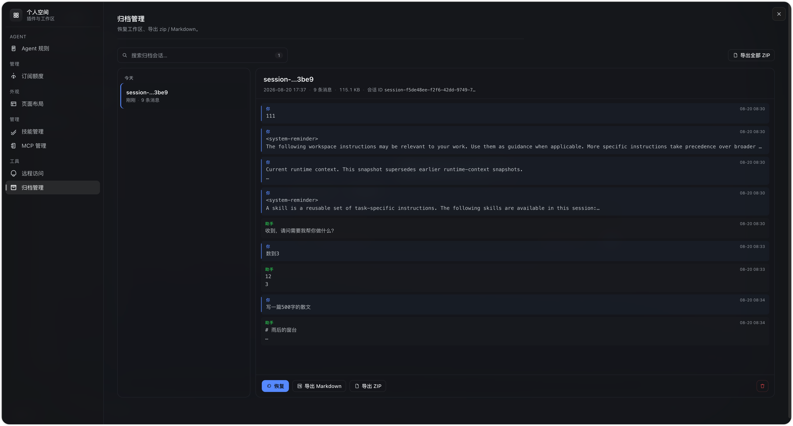
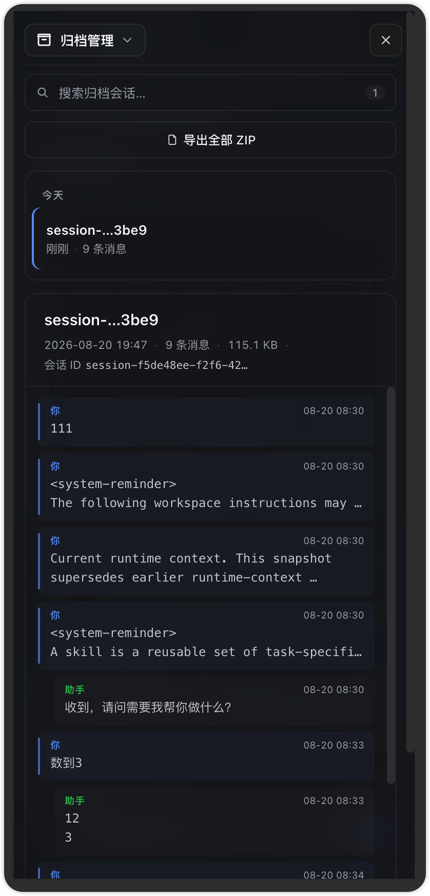

# dsh-archive-manager

**Archive manager for DeepSeek Harness.** Add a "Archive manager" entry to dsh Settings so you can:

<p align="left">
  
  &nbsp;&nbsp;
  <br><em>Desktop — Settings → Archive manager (PC + H5)</em>
</p>

- List every session that has been hidden from a workspace (`workspaceRegistry.archivedSessionIds`)
- Read each archived session's full message history inline (user / assistant / tool call / tool result)
- **Restore** an archived session back to the workspace with one click
- Export each session as either:
  - **zip** — official `/api/session.export` (jsonl log + referenced media)
  - **markdown** — a self-contained transcript rendered by this plugin

Built on the same dsh primitives `dsh-remote-access` and the official three managers use: a host plugin (`dsh-archive-manager` package) + a client module registered into `settings.section` slot.

## Install

```bash
dsh plugin --profile web add https://github.com/huangrx6/dsh-plugin/releases/download/0.1.0/dsh-archive-manager.tgz
```

Or for development:

```bash
git clone https://github.com/huangrx6/dsh-plugin
dsh plugin --profile web add /path/to/dsh-plugin/dsh-archive-manager
```

Restart `dsh web` (with the same `--trusted-host <your-tailscale-name>` you already use). Open **Settings → Archive manager**.

> If you install only on a remote (Tailscale) profile, the phone's official Settings page becomes the archive manager as well — same UI, every namespace reachable over the trusted-host RPC bridge.

## How it works

### Host side

- Wires up a single trusted-host RPC channel `dsh-archive-manager` with one endpoint `archive` and four operations inside its payload:
  - `restore` — drop a sessionId from the workspace's `archivedSessionIds` list via `ctx.workspaceRegistry.enqueueOperation → setState` (the same persistence mutation the official archive path uses, just in reverse). The state change auto-broadcasts `host/archived-sessions-changed`, so every connected client updates together.
  - `export-md` — read session history events from `ctx.sessionPersistence.inspect`, render as Markdown
  - `list` — return summaries (id, title, updatedAt, messageCount) for the workspace's archive set
  - `info` — return the full event list for one session, for in-page rendering
- Hard dependencies: `connection`, `workspaceRegistry`, `sessions`, `sessionPersistence` (all host services — `dsh-archive-manager` itself does not add any storage of its own)

### Client side

- Registers `settings.section` slot with `id: 'archive'`, `order: 60` (after Plugins / Third-party) so it appears as an independent entry in the Settings nav
- Uses `useWorkspaces`-equivalent host path (via our own bridge list op) to enumerate archived ids and merge them with `sessionPersistence.list` metadata
- Subscribes via the same archive channel for restore / export-md

### What this plugin does **not** do

- It does **not** delete sessions from disk. dsh does not expose a session-delete API anywhere (the apiproxy is missing a `sessions.delete` handler, and `SessionPersistence` exposes only `prepare / readRaw / append / list / ...` — no delete). The UI surfaces this explicitly: **hard delete requires removing `~/.dsh/sessions/<id>/` manually on the Mac.**
- It does **not** archive sessions. dsh already has archive via the session header context menu ("Archive session"); the only addition here is surfacing the result of that action.
- It does **not** invent a permission model. Anyone who can call our trusted-host channel can restore / export — same trust boundary as the official `/api/sessions.history` and `/api/session.export` endpoints, which the user has already opted into via `--trusted-host`.

## What the host side touches

| Service | Use |
|---|---|
| `ctx.connection.rpc.handle` | Trusted-host RPC channel `dsh-archive-manager` |
| `ctx.workspaceRegistry` | Read `archivedSessionIds`; `enqueueOperation` to drop a sessionId and persist via `setState` |
| `ctx.sessions.get` | Read in-memory events of live (still-attached) sessions (defensive — archived sessions are usually cold) |
| `ctx.sessionPersistence.inspect` | Read events of a cold / persisted session |
| `ctx.sessionPersistence.list` | Cross-check that an archived id is reachable on disk |

## Tests

`pnpm test` runs 23 unit tests (host logic + markdown rendering + handler dispatch).

```
Test Files  3 passed (3)
     Tests  23 passed (23)
```

The 5 archive summaries returned by `archive.list` on a real profile are an integration signal: the bridge correctly enumerates the workspace's archive set and reads event counts from `inspect()`.

## Files

```
dsh-archive-manager/
├── package.json
├── tsconfig.json / tsconfig.build.json
├── tsdown.config.ts            host + client bundle, matches dsh-remote-access
├── cordis.patch.yml            inject self into the host bundle graph
├── src/
│   ├── contracts.ts            RPC channel + payload + result types
│   ├── restore.ts              pure: workspaceRegistry + setState
│   ├── export-md.ts            pure: history events → markdown
│   ├── index.ts                host apply(): wires handler + trusted-host channel
│   └── client/
│       ├── index.ts            apply(): inject settings.section, register section
│       ├── api.ts              RPC wrappers (list/info/restore/exportMd)
│       ├── ArchiveManagerSection.tsx  the section body (list + detail + actions)
│       ├── locales.ts           zh + en
│       └── styles.ts            injected via plugin tag
├── tests/
│   ├── restore.test.ts
│   ├── export-md.test.ts
│   └── handler.test.ts
└── scripts/clean.mjs + wrap-client.mjs
```
