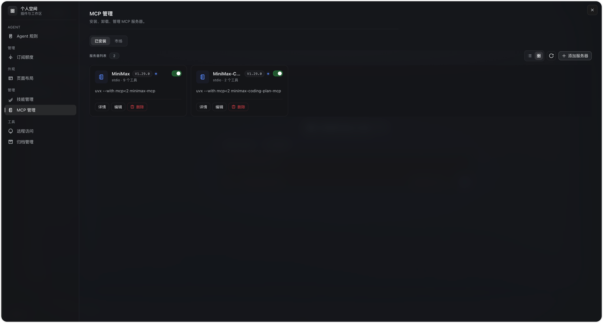
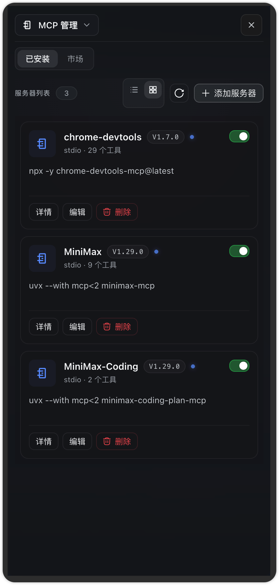

# DSH MCP Manager

`dsh-mcp-manager` 是 [DeepSeek Harness](https://github.com/deepseek-ai/deepseek-harness) Web 端的 MCP 服务器管理插件：把"手编 `cordis.patch.yml` + 重启"的流程换成图形界面——状态总览、增删改、启停、工具明细、连接测试。入口在 **设置 → 插件 → MCP 服务器**。

## 功能

- **状态总览**：每台服务器一张卡片——传输方式、命令 / URL 摘要、Cordis fiber 状态点（运行中 / 失败 / 加载中…，来自 plugin inventory）、已注册工具数、启用 / 停用标签。
- **增删改**：双传输表单（stdio：command / args / 环境变量 / cwd；streamable-http：URL / 请求头）+ 高级项（调用超时、failOnStartupError、自动重连）。写入 profile 层 `cordis.patch.yml`（不可用时回落 home 层），`!!js` 表达式值以只读形式保留、原样回写；另有 YAML 源码模式，直接编辑该服务器的 config。写入前自动留 `.bak` 备份，原子替换。
- **启停**：切换条目 `disabled`；外来条目（非本层插入）只允许停用不允许删除。
- **工具明细**：展开卡片查看每台服务器注册的工具（`mcp__<server>__<tool>` 公开名 + 描述 + 参数 JSON Schema 树）。
- **测试连接**：保存前可让宿主真实拉起（stdio）或连接（http）该服务器，完成 initialize + 分页 tools/list，展示服务端版本、耗时、完整工具清单，随后立即关闭，不注册任何工具。
- **热生效**：patch 文件由 Cordis HMR 监听，保存后自动断开重连，无需重启进程（README 与 `dsh-mcp-client` 行为一致）。

## 架构

- 宿主侧（`src/index.ts`）：注入 `connection` + `tools` + `loader`，在 `/dsh-mcp-manager` 通道（loopback authority）上提供 `list` / `save` / `toggle` / `delete` / `test` / `parseYaml` / `dumpYaml`。
- `src/patch-file.ts`：entry-list YAML 方言的读写——与 `@deepseek-ai/cordis-plugin-include` 相同的 `JSON_SCHEMA + !!js` 标签（js-yaml 4），表达式节点 `{__jsExpr}` 完整往返。
- `src/server-config.ts`：patch → 服务器记录的投影（insert 条目 + 跨层 id-target 覆盖，`config` 整体替换语义与 `applyEntryPatches` 一致）、字段校验（serverName `^[A-Za-z0-9_-]{1,32}$`、按传输的必填项）、编辑操作。
- `src/test-connection.ts`：`@modelcontextprotocol/sdk` 一次性探针。
- Web 侧（`src/client/`）：向 `settings.plugins.tab` 注册 `mcp` 页，zh/en 双语；写入后轮询数次让状态落定。

## 安装

### 方式一：一行安装（推荐，从 GitHub 构建）

DSH 官方 CLI 的 `dsh plugin` 命令会转发给 profile 目录下的 pnpm：

```bash
dsh plugin --profile web add "github:huangrx6/dsh-plugin#main&path:/dsh-mcp-manager"
```

pnpm（≥ 9）会克隆仓库的对应子目录、安装依赖并执行 `prepare` 完成构建。`dsh plugin` 随后会自动对账 `dsh.profile.bundles`——包声明了 `dsh.bundle` 即自动加入加载层，**无需手改任何配置文件**。更新时执行 `dsh plugin --profile web update dsh-mcp-manager`。

### 方式二：固定版本（GitHub Release 预构建包，免本机构建）

仓库打了 `0.x.y` tag 后，GitHub Actions 会自动构建并把 npm tarball 挂到 [Releases](https://github.com/huangrx6/dsh-plugin/releases)。从 Release 页复制对应包的 `.tgz` 地址（路径带版本号、文件名不带）：

```bash
dsh plugin --profile web add https://github.com/huangrx6/dsh-plugin/releases/download/0.1.0/dsh-mcp-manager.tgz
```

### 方式三：本地开发（link 热迭代）

```bash
git clone git@github.com:huangrx6/dsh-plugin.git
cd dsh-plugin/dsh-mcp-manager && pnpm install && pnpm run build
```

profile（`~/.dsh/profiles/web/package.json`）：

```json
{
  "dependencies": { "dsh-mcp-manager": "link:/绝对路径/dsh-plugin/dsh-mcp-manager" },
  "dsh": { "profile": { "bundles": ["@deepseek-ai/dsh-base", "@deepseek-ai/dsh-web-app", "dsh-mcp-manager"] } }
}
```

然后 `cd ~/.dsh/profiles/web && pnpm install` 并重启 DSH。

## 开发

```bash
pnpm install
pnpm run check   # typecheck + vitest + build
```

## MCP 市场（dsh-launcher 集成）

`dsh-mcp-manager` 自带一个 **MCP 市场** UI（`McpMarketSection`）。当用户同时安装了 [`dsh-launcher`](../dsh-launcher) 时，该市场会在 launcher 的全屏工作区里出现——左侧菜单选 **MCP 管理**，右侧会看到卡片化市场。

<p align="left">
  
  &nbsp;&nbsp;
  <br><em>桌面端 — 设置 → 插件 → MCP 管理（PC + H5）</em>
</p>

市场的核心组件复用自 launcher（`dsh-launcher/client/market` 的 `MarketShelf`），本插件只负责：

- `onInstall`：从 manifest item 的 `payload` 解析出 `McpServerConfig`（stdio / streamable-http 两种），调用现有的 `save` 端点（同一个 `dsh-mcp-manager` host RPC）。
- `onRemove`：通过 `McpServerView.removable` 判断是否可删，调用现有的 `delete` 端点。
- `isInstalled`：用 `McpServerView.serverName` 匹配 manifest item `id`。

如果未装 launcher，工作区里 "MCP 管理" 这一栏会显示 launcher 的默认占位；现有的 "设置 → 插件 → MCP 服务器" 入口完全不受影响。

## 清单 payload 约定

MCP 市场的 manifest 项 `payload` 是 launcher 当作不透明对象传入的，本插件按以下约定解读：

```jsonc
// stdio
{
  "id": "mcp-filesystem",
  "name": "Filesystem",
  "description": "...",
  "kind": "mcp",
  "payload": {
    "serverName": "filesystem",
    "transport": "stdio",
    "command": "npx",
    "args": ["-y", "@modelcontextprotocol/server-filesystem"]
  }
}

// streamable-http
{
  "id": "mcp-fetch",
  "name": "Fetch",
  "description": "...",
  "kind": "mcp",
  "payload": {
    "serverName": "fetch",
    "transport": "streamable-http",
    "url": "https://example.com/mcp"
  }
}
```

`serverName` 缺省时用 manifest `id`；`transport` 决定后续字段必填校验（stdio → `command`，http → `url`）。卸载从 `McpListResponse.servers` 里按 `serverName` 匹配回 `entryId`，所以 manifest 作者要保证 `serverName` 与本机能查到的 server 一致。
